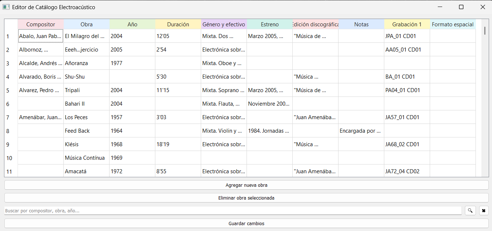

# Catálogo de Música Electroacústica en Chile

Este proyecto es una aplicación de escritorio para **visualizar, editar y mantener un catálogo de obras de música electroacústica producidas en Chile**, mediante una interfaz gráfica simple y directa.

El catálogo se almacena como un archivo CSV en **Google Drive**, lo que permite trabajar de forma centralizada y mantener una única versión actualizada.

---

## Características

- Visualización del catálogo en una tabla editable.
- Agregar nuevas obras mediante un formulario.
- Eliminar obras seleccionadas.
- Búsqueda flexible por compositor, obra, año u otros campos.
- Normalización automática de nombres de compositores.
- Guardado directo del catálogo en Google Drive (CSV).

---

## Requisitos

- Python 3.12
- PyQt5
- pandas
- Google API Client (Drive)

Instalación de dependencias principales:

pip install PyQt5 pandas google-api-python-client google-auth google-auth-oauthlib

## Ejecución

Desde la carpeta del proyecto:

python app.py

Es necesario contar con:
- `credentials.json` (OAuth de Google)
- `token.json` (se genera automáticamente al primer inicio de sesión)
- El `FILE_ID` correcto del archivo CSV en Google Drive

---

## Búsqueda

El buscador permite filtrar obras de forma insensible a:
- mayúsculas y minúsculas
- tildes
- orden nombre/apellido del compositor
- presencia o ausencia de fechas entre paréntesis

El botón ✖ restablece la vista completa del catálogo.

## Autor

**Esaú Medina Lucero**  
https://github.com/EsaMed

Este trabajo forma parte del proyecto **Fondecyt de Iniciación 11241059**  
*“Establishing foundations for the implementation of neutral level analysis of the spatial composition of acousmatic works”*

---

## Captura de la aplicación

